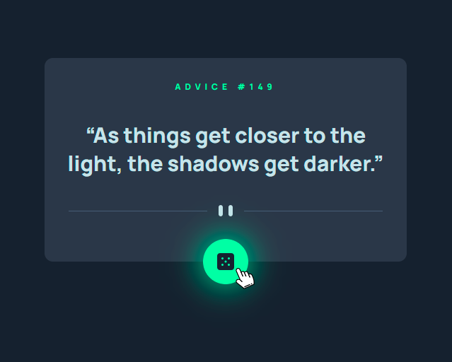
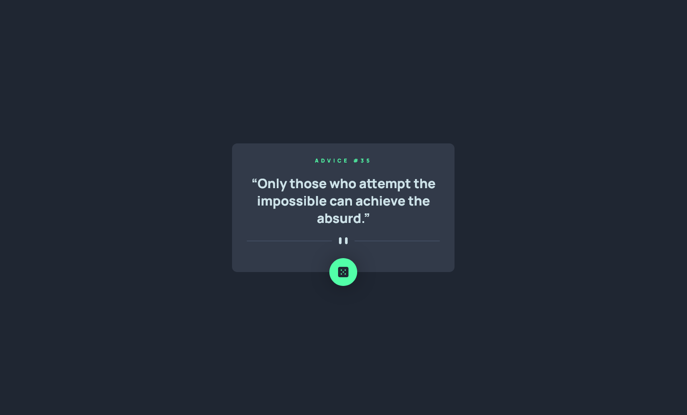

<!-- markdownlint-disable MD033 -->
<h1 align="center">Frontend Mentor – Advice Generator App</h1>

This is a solution to Frontend Mentor's <a href="https://www.frontendmentor.io/challenges/advice-generator-app-QdUG-13db"> Advice Generator App Challenge</a>.

<h3 align="center">Languages</h3>

  <a href="#">English</a> • <a href="./lang/README.pt-br.md">Português</a>

<!-- markdownlint-enable MD033 -->

## Table of contents

- [Overview](#overview)
  - [The challenge](#the-challenge)
  - [Screenshots](#screenshots)
  - [Links](#links)
- [My process](#my-process)
  - [Built with](#built-with)
  - [What I learned](#what-i-learned)
- [Author](#author)

## Overview

### The challenge

- View the optimal layout for the app depending on their device's screen size
- See hover states for all interactive elements on the page
- Generate a new piece of advice by clicking the dice icon

### Screenshots

| Desktop View (1280px) | Hover | Mobile View (375px)|
|-------|-------|-------|
||||

### Links

- Live Site URL: [Cloudfare Pages](https://fm--advice-generator-app.pages.dev/)

## My process

### Built with

- Semantic HTML5 markup
- Mobile-first workflow
- React
- Typescript
- TailwindCSS
- Axios
- Vite

### What I learned

Though I didn't have much of a challenge, I tried to make a simple animation of Fade In/Out. It is reasonably simple after you've done it, but at first it may seem like a challenge.

## Author

- [My personal website](https://amodeusr.pages.dev)
- Github - [@AmodeusR](https://github.com/amodeusr)
- Linkedin - [@AmodeusR](https://www.linkedin.com/in/AmodeusR)
- Frontend Mentor - [@AmodeusR](https://www.frontendmentor.io/profile/AmodeusR)
