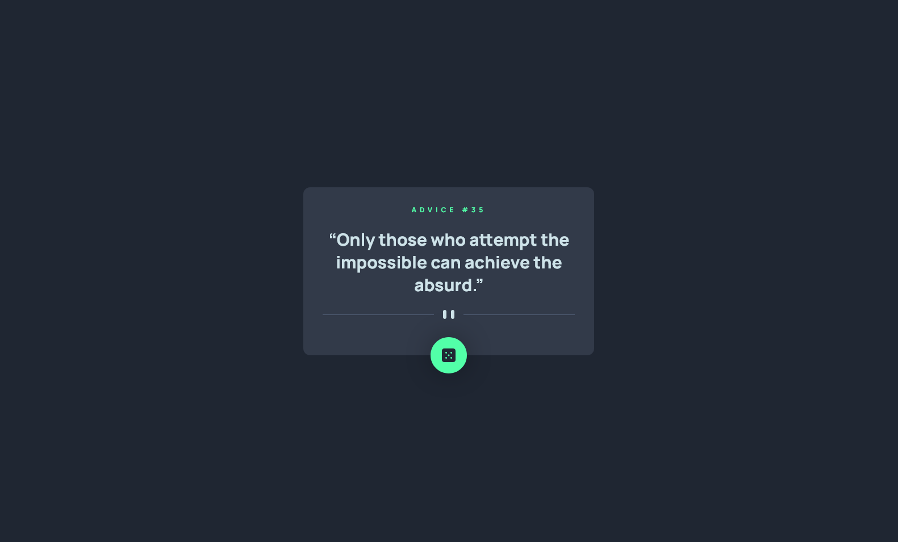
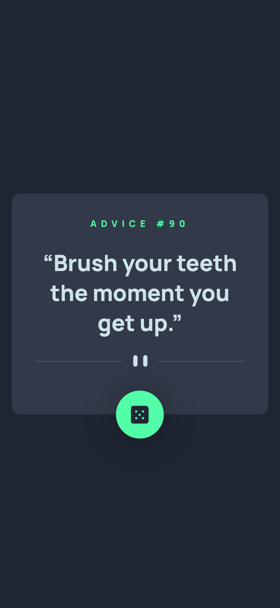

<!-- markdownlint-disable MD033 -->
<h1 align="center">Frontend Mentor — App Gerador de Conselhos</h1>

Esta é uma resolução ao desafio <a href="https://www.frontendmentor.io/challenges/advice-generator-app-QdUG-13db">App Gerador de Conselhos</a> por Frontend Mentor.

<h3 align="center">Idiomas</h3>

  <a href="../README.md">English</a> • <a href="#">Português</a>

<!-- markdownlint-enable MD033 -->

## Índice

- [Visão Geral](#visão-geral)
  - [O desafio](#o-desafio)
  - [Capturas de tela](#capturas-de-tela)
  - [Links](#links)
- [Meu processo](#meu-processo)
  - [Desenvolvido com...](#desenvolvido-com)
  - [O que aprendi](#o-que-aprendi)
- [Autor](#autor)

## Visão geral

### O desafio

- Exibir o layout ideal baseado no tamanho da tela do usuário
- Exibir efeitos de hover para todos os elementos interativos na página
- Gerar um novo conselho ao clicar no ícone do dado

### Capturas de tela

| Tela Desktop (1280px) | Efeito Hover | Tela Celular (375px) |
|-------|-------|-------|
||||

### Links

- URL para o Site: [Cloudfare Pages](https://fm--advice-generator-app.pages.dev/)

## Meu processo

### Desenvolvido com...

- Semantic HTML5 markup
- Mobile-first workflow
- React
- Typescript
- TailwindCSS
- Axios
- Vite

### O que aprendi

Though I didn't have much of a challenge, I tried to make a simple animation of Fade In/Out. It is reasonably simple after you've done it, but at first it may seem like a challenge.

## Autor

- [Meu site pessoal](https://amodeusr.pages.dev)
- Github - [@AmodeusR](https://github.com/amodeusr)
- Linkedin - [@AmodeusR](https://www.linkedin.com/in/AmodeusR)
- Frontend Mentor - [@AmodeusR](https://www.frontendmentor.io/profile/AmodeusR)
